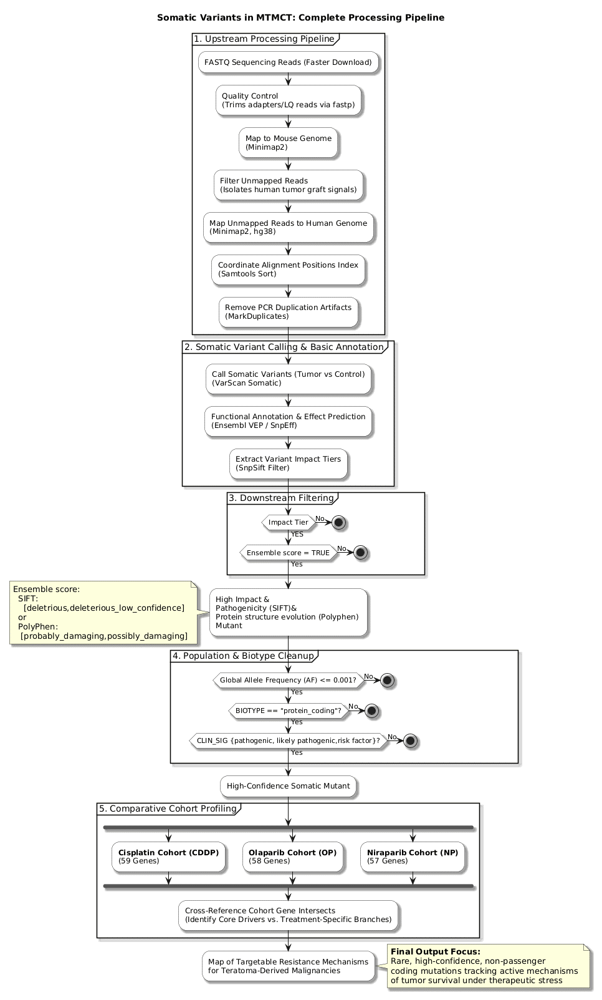
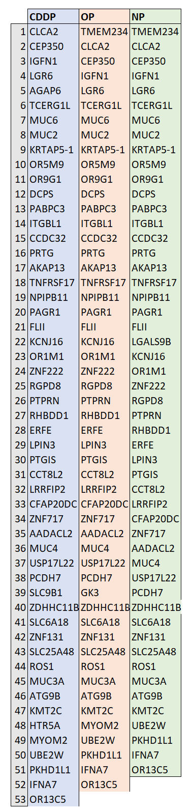
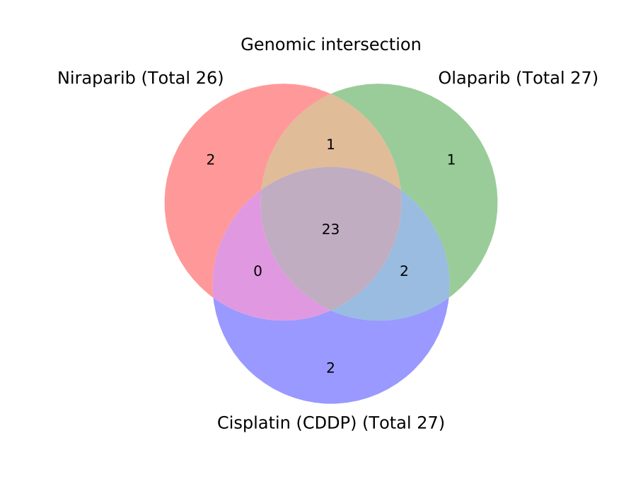

# Analysis of Germline and somatic variants of MTMCT 
 

**Keywords** 
Somatic variant calling, PDX xenograft, Malignant Transformation of Mature Cystic Teratoma (MTMCT), PARP inhibitors (PARPi) 
 

**Objective** 
MTMCT that undergoes malignant transformation (most commonly to squamous cell carcinoma), may be sensitive to PARP inhibitors, which work by exploiting lethality in tumor cells that cannot repair double-strand DNA breaks via the homologous recombination (HR) pathway. 
The purpose of this study was to detect any somatic mutations in tumor cells that could enable the tumor cells to survive treatment with PARP inhibitors or Cisplatin.  

# Introduction
Analysis of Somatic mutations of a highly malignant tumor. Data taken from [1] 
 
This Case study is about Malignant Transformation of Mature Cystic Teratoma (MTMCT) using a Patient-Derived Xenograft (PDX) mouse model treated with PARP inhibitors (PARPi), followed by Whole Exome Sequencing (WES). 
 
Mature cystic teratomas (termed dermoid cysts) originate from partogenous activation of a single germ cell that has undergone faulty oogenesis.  
These benign tumors inherently possess massive, genome-wide blocks of homozygosities — meaning that they exhibit high baseline LOH without necessarily being deficient in DNA repair. 
 
# Experimental setup
 
This study has following samples: 
 - Control DNA (SRR32341090) -> Untreated MTMCT PDX tumor represents a baseline against all treated samples are compared  
 - CDDP_DNA (SRR32341089) -> Cisplatin treatment induces bulky DNA cross-links. Tumors with HR deficiency are sensitive to both Cisplatin and PARP inhibitors 
 - Olaparib_DNA (SRR32341088) -> Residual tumor under Olaparib (PARPi) selective pressure 
 - Niraparib_DNA (SRR32341087) -> Residual tumor under Niraparib (PARPi) selective pressure. 
 
Since background meiotic LOH is present in all samples, the focus is on treatment-induced somatic alteration. This is done by comparing all treated samples to control sample, which subtracts the background meiotic LOH.
 

# WES Pipeline
 
The complete pipeline I used to process data from this study is shown on Figure 1. 
 

 
## Quality Control & Adapter Trimming
 
Inital preprocessing steps included QC and adapter trimming (fastp). 
 

## Mouse Stroma Deconvolution
 
Sequencing of a residual mouse PDX tumor means that the sample will contain varying amounts of mouse stromal cells infiltrating the human tumor mass. Before running variant or copy-number callers, raw reads need to be filtered in order to separate human from mouse reads. Separating mouse residual reads from graft (human) was done using Dual-Alignment strategy: 
 - Step 1: Align reads to Mouse Genome (mm39) (Minimap2) 
 - Step 2: Extract the unmapped reads (Samtools fastx) 
 - Step 3: Align the unmapped reads to the Human Genome (hg38) (Minimap2) 
 - Step 4: Sort reads (Samtools sort) 
 - Step 5: Mark duplicates (Mark duplicates). 
 
Processing reads in this way ensures that any read moving forward into variant calling pipeline is human tumor DNA. 
 

## Variant calling & Annotation
 
VarScan Somatic tool was run three times, comparing each treated sample to control sample. After that, only true somatic entries were extracted (Snpsift filter) and annotated (SnpEff annotate). 
Variant effects were predicted (Predict variant effects with VEP) and only those that carry Impact level HIGH or MODERATE were selected for final list.
 
 
List of Somatic mutations for CDDP sample 

 
 
 
List of Somatic mutations for Olaparib sample 

 
 
 
List of Somatic mutations for Niraparib sample 

 
 
 
All the genes from all three treatments, filtered to contain a single entry for each gene and shown only with the modification impact are presented in Table 1.

Same list is used to create Venn diagram (Figure 2) with all three treatment branches and intersections between branches highlighted. 
 

 

# Discussion
 
The filtered list contains a collection of mutated genes damaged under the drug pressure. If a mutation completely broke an essential housekeeping gene that the cell needs to stay alive, that cell would have died before the sequencing run and its DNA would have vanished from the sample. So, in the final list I focused on genes whose mutation would have been beneficial to the survival of the tumor cell: 
 - Category 1: Mutations that enable the tumor to bypass cell safety mechanism and survive 
 - Category 2: Mutations that enable the tumor to adapt survival and defense mechanisms  
 - Category 3: Mutations that enable the tumor to modify extracellular mechanisms and response to immune system. 
 

**Category 1** (HIGH Impact Loss-of-Function) 
Tumor benefits from non-functional protein to disable its own cellular safety triggers for cell senescence/apoptosis. These are possible options: 
 - BNIP1 (HIGH in Cisplatin) 
   - It normally acts as a pro-apoptotic sensor that forces heavily damaged cells to undergo suicide 
   - By knocking it out, the tumor cell survives platinum cross-links because it can no longer trigger apoptosis 
 - PPP1R15A (HIGH in Olaparib) 
   - It normally forces a cell experiencing massive replication stress into strict growth arrest 
   - Truncating it allows the tumor to bypass the checkpoint and keep dividing despite trapped PARP complexes 
 
**Category 2** (MODERATE Impact - Missense) 
Tumor uses single amino acid tweaks to over-activate pathways or optimize cellular machinery to handle continuous stress without dying: 
 - IRS2 (MODERATE in Olaparib) 
   - Instead of destroying the protein, this missense modification alters its shape to continuously pump pro-survival PI3K/Akt signaling throughout the cell 
 - NEK11 (MODERATE) in Niraparib) 
   - It subtly adjusts the G2/M DNA damage checkpoint clock. It doesn't break the cell cycle entirely; it tunes it just enough to let the cell patch its replication forks before dividing. 
 
Category 3 (MODERATE Impact) 
Tumor modifies its exterior surface to protect its newly transformed epithelial components and hide from immune clearing  
 - MUC16 (MODERATE in Olaparib, Niraparib) 
   - Mutating the CA-125 matrix architecture helps tracking and anchoring the malignant cells during targeted selection  
 - HLA-DQA2 (MODERATE in Olaparib, Niraparib) 
   - Altering these major histocompatibility complexes serves to mute local microenvironmental immune surveillance while the tumor undergoes massive structural genomic shifts. 
 

**References**  
[1] Project PRJNA1223657 (NCBI), High LOH MTMCT, To evaluate genomic alteration by PARP inhibitors for high LOH malignant transformation of mature cystic teratoma
